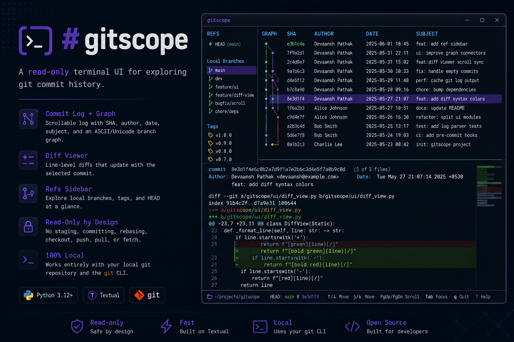

# gitscope



gitscope is a read-only terminal UI for exploring git commit history: log rows, branch topology, refs, and selected-commit diffs in one local view. It exists as a focused personal/portfolio project for making history easier to scan without adding git workflow actions.

## Features

- Scrollable commit log for the current branch/HEAD or all branches, including SHA, author, date, and subject.
- ASCII/Unicode branch graph gutter aligned with the log, including branch lanes and merge topology.
- Scrollable line-level diff pane that updates when the selected commit changes.
- Branch/ref sidebar for local branches, tags, and HEAD.
- Status bar showing the repository path, current HEAD, and key hints.
- Incremental history loading so startup is bounded by the first page of commits.
- Read-only by design: no staging, committing, rebasing, checkout, push, pull, or fetch operations.

## Installation

Prerequisites:

- Python 3.12+
- A local `git` binary available on `PATH`
- A git repository already present on disk

Install from source:

```bash
git clone <repo-url>
cd gitscope
python -m pip install .
```

For local development:

```bash
python -m pip install -e .
python -m pytest
```

## Usage

Run `gitscope` from inside a git repository:

```bash
cd path/to/repo
gitscope
```

Current bindings:

- `q`: quit
- `r`: refresh
- `m`: load more commits
- `a`: show all local branches
- `h`: show HEAD
- `Up` / `Down` or `j` / `k`: move the selected commit
- `PgUp` / `PgDn`: scroll the focused pane
- `Tab`: switch focus
- `?`: show help text

## Status

gitscope is early and actively developed. The v1 path is focused on a local, read-only commit history viewer with source installation, bounded history loading, refs, graph, diff, and status panes working together.

Known v1 limitations:

- Line-level diffs only; no word-level intraline highlighting.
- No config files, custom themes, or plugin system.
- No remote/network features and no mutating git operations.
